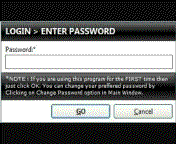



## A MESCURE FOLDER PROTECTION

### Description

It protects your folder by calling encryption algorithm. If the protected folder is opened, it shows another places such as HTML Document, Recycle Bin, Control Panel etc. It contains a login screen thatfor anyone can't open it. Includes a stand alone helpmanual.

If you like it, plz vote me.
 
### More Info
 
Once you forgot your password, you can't retrieve it.

             |
---                |---
**Submitted On**   |2010-03-01 18:30:18
**By**             |[Manaruchi Mohapatra](https://github.com/Planet-Source-Code/PSCIndex/blob/master/ByAuthor/manaruchi-mohapatra.md)
**Level**          |Intermediate
**User Rating**    |4.5 (18 globes from 4 users)
**Compatibility**  |VB 6\.0
**Category**       |[Encryption](https://github.com/Planet-Source-Code/PSCIndex/blob/master/ByCategory/encryption__1-48.md)
**World**          |[Visual Basic](https://github.com/Planet-Source-Code/PSCIndex/blob/master/ByWorld/visual-basic.md)
**Archive File**   |[A\_MESCURE\_2177623222010\.zip](https://github.com/Planet-Source-Code/manaruchi-mohapatra-a-mescure-folder-protection__1-73021/archive/master.zip)

